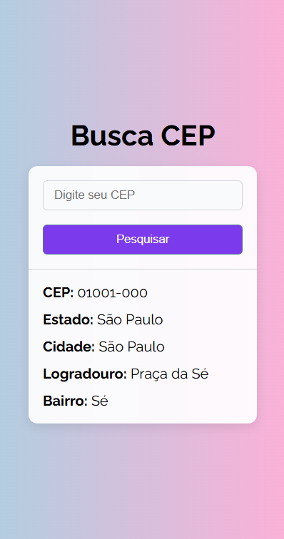
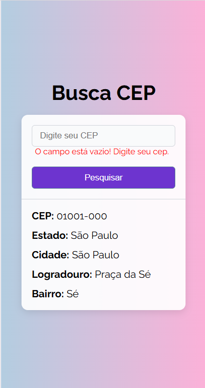

## <p align="center"> Buscador de CEP</p>

**<p align="center">Trabalho Acadêmico - Refatoração de Código e Boas Práticas do Clean Code</p>**

<br>

Este programa permite ao usuário digitar um CEP e, automaticamente, busca as informações de endereço correspondentes, como rua, bairro, cidade e estado. A consulta é feita por meio de uma API de CEP.

Este projeto faz parte do trabalho acadêmico A3 com tema Refatoração de Código e Boas Práticas do Clean Code, com foco em melhorar a legibilidade, manutenibilidade e eficiência de um código legado sem alterar a sua funcionalidade.

<br>

## 🎬Demonstração

**Versão web**


<table>
  <tr>
    <td></td>
    <td></td>
    <td></td>
  </tr>
</table>

<br>

## 💡Funcionalidades

- Entrada de cep pelo usuário.
- Consulta à API de endereços.
- Exibição de dados de enedereço.
- Tratamento de erros.
- Interface intuitiva.
- Opção de nova consulta.

<br>

## ⚙️Rodando localmente

Clone o projeto

```bash
  git clone https://github.com/Mari-Goncalves/Atividade-avaliativa-A3-UC-Gestao-e-Qualidade-de-software.git
```

Entre no diretório do projeto

```bash
  cd busca-cep
```

Instale as dependências

```bash
  npm install
```

Inicie o servidor

```bash
  npm run dev
```

<br>

## ✍️Autores

- [@Mari-Goncalves](https://github.com/Mari-Goncalves)
- [@Maria-Vitoria123](https://github.com/Maria-Vitoria123)
- [@Zentryak](https://github.com/Zentryak)
- [@BismarckGabriel](https://github.com/BismarckGabriel)
- [@LucianoLopes25](https://github.com/LucianoLopes25)

<br>

##  📚Referência

 - [Via CEP - API de consulta ao CEP](https://viacep.com.br/)
